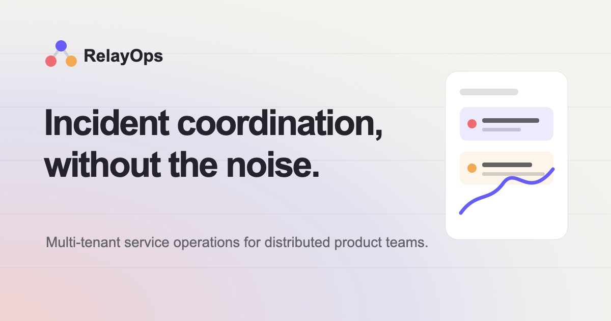

# Khalid Oyeneye Portfolio v2

A type-led, motion-aware portfolio for [Khalid Oyeneye](https://github.com/khalteck), a fullstack
SaaS engineer. The experience helps recruiters and technical decision-makers evaluate Khalid's
web, mobile, backend, product engineering, and delivery work, then move directly to a case study,
résumé, or email conversation.

> **Release status:** v2 is developed on `revamp/v2`. The previous portfolio is preserved on
> `archive/v1` and at tag `v1.0.0`. `https://khalidoyeneye.dev` is the production target, but this
> README does not claim that the v2 branch has been merged, deployed, or DNS-verified.



## Experience

The homepage follows this sequence:

1. hero with role, availability, career metrics, and contact actions;
2. about and capabilities;
3. technology stack grouped by responsibility;
4. experience with four résumé-backed roles;
5. selected projects with four published case studies plus two development-only in-progress slots;
   and
6. contact footer with location, email, social profiles, résumé, and analytics preferences.

There is no contact-form simulation, CMS, backend, theme switcher, portrait, or unverified social
channel. Google Analytics 4 is optional, requires a public measurement ID, and loads only after
visitor consent.
The primary conversion path is a plain `mailto:` link. The secondary path opens the RelayOps case
study.

### Public routes

| Route                           | Purpose                                                          |
| ------------------------------- | ---------------------------------------------------------------- |
| `/`                             | Complete portfolio narrative and selected-project index          |
| `/projects/relayops`            | 2026 full-stack incident-operations case study with public links |
| `/projects/tci-podcast`         | React/Redux Toolkit/Firebase client and admin-CMS case study     |
| `/projects/afrogrids`           | Fullstack storytelling platform and custom Firebase CMS          |
| `/projects/greencity-financial` | Financial-services platform and live data integrations           |
| `*`                             | Accessible branded 404 with a route home                         |

Only these five real routes are prerendered and included in the sitemap. Incoming projects 05 and 06
appear only on the local Vite development site and have no production card, slug, link, metadata,
structured-data entry, or outcome claim.

## Architecture

- React 19, React Router 7, Vite 7, and strict TypeScript provide the application and route layer.
- Tailwind CSS 4 and semantic CSS custom properties implement the charcoal, warm off-white,
  muted-gray, and electric-green editorial system.
- `src/data/portfolio.ts` is the single publishable-content source. Types in
  `src/types/portfolio.ts` separate `PublishedProject` from non-routable `IncomingProject` data.
- GSAP and ScrollTrigger own coordinated reveals and route layers; Lenis has one smooth-scroll
  lifecycle; CSS owns simple hover and focus transitions. The fixed section dock bypasses route
  layers so section links scroll without a transition wipe.
- The production build creates the Vite client bundle, an SSR rendering bundle used only at build
  time, and static HTML for each real route. React then hydrates those pages in the browser.
- Netlify serves the generated static output, uses an SPA fallback for unknown client routes, caches
  hashed assets immutably, and applies static security headers.

The architecture decisions are recorded in [`docs/decisions`](docs/decisions), with editing rules
in [`docs/content-model.md`](docs/content-model.md).

## Local development

Requirements:

- Node.js 24
- Corepack
- pnpm 10.32.1 (pinned by `packageManager`)

```bash
corepack enable
pnpm install --frozen-lockfile
pnpm dev
```

Vite defaults to `http://localhost:5173`. Analytics is optional; add `VITE_GA_MEASUREMENT_ID` to
enable the consent prompt, manual route views, and portfolio conversion events. Never put a secret
in a `VITE_` variable because Vite exposes those values to the browser bundle.

### Commands

| Command              | Responsibility                                                          |
| -------------------- | ----------------------------------------------------------------------- |
| `pnpm dev`           | Start the Vite development server                                       |
| `pnpm format`        | Rewrite supported files with Prettier                                   |
| `pnpm format:check`  | Check formatting without rewriting                                      |
| `pnpm lint`          | Run ESLint with zero allowed warnings                                   |
| `pnpm typecheck`     | Check application and tooling TypeScript projects                       |
| `pnpm test`          | Run Vitest once                                                         |
| `pnpm test:coverage` | Run Vitest with configured coverage thresholds                          |
| `pnpm build`         | Build, prerender real routes, and validate static output                |
| `pnpm build:analyze` | Produce the opt-in Rollup visualizer report                             |
| `pnpm preview`       | Serve the production build locally                                      |
| `pnpm e2e`           | Run Playwright in Chromium, Firefox, and WebKit                         |
| `pnpm e2e:smoke`     | Run Playwright tests tagged `@smoke`                                    |
| `pnpm lighthouse`    | Run the configured repeatable Lighthouse CI audit                       |
| `pnpm verify`        | Check format, lint, types, coverage, build, prerender, and static files |

Run `pnpm verify`, `pnpm e2e`, and `pnpm lighthouse` before promoting the branch. A command being
listed is not a claim that it passed on a particular machine or commit; record actual results in the
pull request or release handoff.

## Editing content

Edit professional copy and data in `src/data/portfolio.ts`, then keep its types and evidence rules
intact. Do not place résumé facts directly in components.

- Experience dates, titles, and impact figures must remain consistent with the retained résumé.
- An impact figure belongs only to the employer that supplied its evidence. Iroko holds the 50%,
  70%, and 95% résumé-reported figures; Agrofeed holds the 20% and 100% figures.
- RelayOps claims are limited to public deployment, two independently deployable services,
  documented test architecture, and explicitly scoped coverage artifacts. Do not turn those into
  adoption, revenue, customer, whole-repository coverage, or currently-green-CI claims.
- TCI Podcast has no published year, live URL, source URL, or quantitative outcome until each is
  re-verified.
- Replace an incoming project only when its title, role, evidence, copy, images, and any public URLs
  are approved. Convert it to `status: "published"`; do not add routing fields to an incoming item.

Image dimensions and confidentiality rules are detailed in
[`docs/content-model.md`](docs/content-model.md). Public media belongs under
`public/images/projects/<slug>/` as responsive AVIF/WebP assets with explicit dimensions and useful
alt text.

## Motion, accessibility, and performance

Motion is progressive enhancement. Final text exists before animation runs. Pointer previews, the
custom cursor, magnetic movement, Lenis scrolling, the delayed preloader, and transition wipes are
absent for reduced-motion users. The particle field remains visible but static. Pointer-specific
effects are also omitted for coarse pointers and narrow layouts. See
[`docs/motion-system.md`](docs/motion-system.md).

The accessibility target is WCAG 2.2 AA. The application includes landmarks, a skip link, logical
route headings, visible focus, a fixed labelled section navigator, a polite route announcer,
keyboard-accessible project rows, responsive inline media, and safe external-link attributes.
Automated checks support, but do not replace, the manual assistive-technology checklist in
[`docs/accessibility.md`](docs/accessibility.md).

Configured quality budgets are:

- initial JavaScript: at most 250 KiB gzip;
- initial homepage transfer: at most 1.5 MiB;
- critical preview image: at most 250 KiB;
- cumulative layout shift: at most 0.1; and
- largest contentful paint: at most 2.5 seconds under the documented Lighthouse profile.

Route-specific titles, descriptions, canonicals, Open Graph data, sitemap entries, robots policy,
manifest, and prerendered markup cover only published routes. Performance budgets require measured
verification; they are not guaranteed by documentation alone.

## Deployment

The intended release flow is:

```text
archive/v1 + v1.0.0 (preserved)
            ↓
revamp/v2 → review and verification → merge to Netlify-connected default branch → production smoke test
```

Do not deploy from this README. Follow [`docs/deployment.md`](docs/deployment.md) for the ordered
production gate, including direct-route checks, response headers, canonical URLs, domain/DNS, and
rollback. No DNS or live-site change is part of the source build itself.

## Attribution

The visual system is an original implementation for Khalid, informed by the premium pacing and
interaction categories of [Tajmirul Islam's portfolio](https://www.tajmirul.site/) and its
[MIT-licensed reference repository](https://github.com/Tajmirul/portfolio-2.0). No reference name
treatment, personal copy, logo, imagery, cursor artwork, or source code is reproduced.

## Known boundaries

- Projects 05 and 06 are development-only editorial placeholders and are omitted from production.
- TCI Podcast intentionally omits unreliable live/source links, an unverified year, and invented
  results.
- RelayOps screenshots use demonstration data; reported coverage applies only to the named critical
  surfaces.
- GA4 is disabled until `VITE_GA_MEASUREMENT_ID` is configured and the visitor allows analytics.
- Production deployment, DNS state, cross-browser results, Lighthouse measurements, and CI status
  must be verified against the exact release commit; this README does not claim them as complete.
